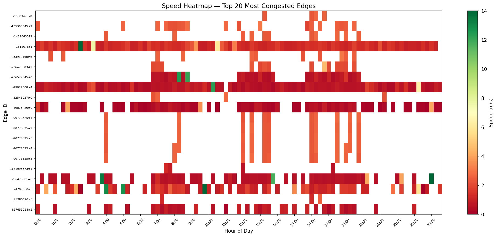

# 🚦 Chișinău Traffic Simulation

A high-fidelity traffic simulation of Chișinău, Moldova, built with [SUMO](https://eclipse.dev/sumo/) and visualized with [deck.gl](https://deck.gl). Models 50,000 vehicles/day across all 8 city districts with realistic peak-hour demand, 265 traffic lights, and 45 roundabouts.



## Overview

This project builds a full city-scale microsimulation of Chișinău's road network to identify congestion bottlenecks, analyze intersection performance, and visualize traffic flow patterns. The interactive visualization shows individual vehicle movements with headlights, brake lights, and lane-level road congestion in real time.

**Key stats:**
- 🗺️ Full city OSM network — 265 traffic lights, 45 roundabouts
- 🚗 50,000 vehicles/day across 8 districts (Centru, Botanica, Buiucani, Râșcani, Ciocana, Sculeni, Telecentru, Durlești)
- 📊 Calibrated to real Chișinău peak patterns (07:00–09:00 morning peak, 17:00–19:00 evening peak)
- ✅ 99.8% trip completion rate, mean travel time 9.6 min

## ⚠️ What's Not in This Repo

The following files are **excluded from git** because they are either too large (>100MB) or fully regeneratable by running the pipeline. You must generate them before running the simulation:

| File | Size | Why excluded | How to get it |
|------|------|-------------|---------------|
| `data/sumo_net/network.net.xml` | 298MB | Too large | Run `netconvert` (Step 2 below) |
| `data/osm/chisinau_full.osm` | 281MB | Too large | Download from Overpass API (Step 1) |
| `data/demand/trips.rou.xml` | 65MB | Regeneratable | Run `duarouter` (Step 3) |
| `data/outputs/fcd_peak.xml` | 34MB | Regeneratable | Run SUMO simulation (Step 4) |
| `data/outputs/deck.min.js` | 1.5MB | Third-party lib | `curl` one-liner (Step 5) |

## 🚀 Quick Start — Full Pipeline

Follow these steps in order to go from zero to running visualization:

**Step 1 — Download OSM data**
```bash
# Download Chișinău OSM extract (bbox covers full city)
# Go to https://overpass-api.de/api/map?bbox=28.75,46.90,29.00,47.08
# Save as data/osm/chisinau_full.osm
```

**Step 2 — Build SUMO network**
```bash
netconvert --osm-files data/osm/chisinau_full.osm \
  --output-file data/sumo_net/network.net.xml \
  --geometry.remove --roundabouts.guess \
  --ramps.guess --junctions.join \
  --tls.guess-signals --tls.discard-simple \
  --tls.join --tls.default-type actuated
```

**Step 3 — Generate routes** (assign paths to all 50,142 trips)
```bash
duarouter --net-file data/sumo_net/network.net.xml \
  --route-files data/demand/trips.trips.xml \
  --output-file data/demand/trips.rou.xml \
  --ignore-errors --no-warnings
```

**Step 4 — Run the simulation**
```bash
cd data/outputs
sumo -c corridor.sumocfg --duration-log.statistics true
# Runtime: ~10-20 min depending on hardware
# Outputs: fcd_peak.xml, edgedata.xml, tripinfo.xml
```

**Step 5 — Launch the visualization**
```bash
cd data/outputs

# Download deck.gl library (one-time, ~1.5MB)
curl -L -o deck.min.js "https://unpkg.com/deck.gl@8.9.35/dist.min.js"

# Start local server
python3 -m http.server 8765

# Open in browser
open http://localhost:8765/chisinau_traffic.html
```

> **Note:** Steps 1–4 require SUMO 1.26.0 installed. The visualization in Step 5 works standalone with the pre-computed files already included in the repo (`trips_deckgl.json`, `roads_congestion.geojson`, `traffic_lights.json`). If you just want to explore the visualization without re-running the simulation, skip to Step 5.

---

## Interactive Visualization

The `data/outputs/chisinau_traffic.html` file is a deck.gl web app showing:
- Animated vehicle movements with headlights 💡 and brake lights 🔴
- Lane-level road congestion coloring (severe → free flow)
- Animated traffic lights 🚦 with realistic phase cycling
- Live stats: active vehicles, avg speed, congested roads %
- Top 5 congested intersections and streets with click-to-fly

### Running the visualization

```bash
# Download deck.gl (one-time, ~1.5MB)
cd data/outputs
curl -L -o deck.min.js "https://unpkg.com/deck.gl@8.9.35/dist.min.js"

# Start local server
python3 -m http.server 8765

# Open in browser
open http://localhost:8765/chisinau_traffic.html
```

## Project Structure

```
chisinau-commute-upgrade/
├── data/
│   ├── demand/
│   │   ├── od_matrix.csv           # Origin-destination matrix (8 districts)
│   │   └── trips.trips.xml         # SUMO trip definitions (50,142 trips)
│   ├── outputs/
│   │   ├── chisinau_traffic.html   # 🎯 Main interactive visualization
│   │   ├── congestion_map.html     # Static Folium congestion map
│   │   ├── roads_congestion.geojson # Lane-level congestion data
│   │   ├── traffic_lights.json     # TLS node positions
│   │   ├── trips_deckgl.json       # Vehicle trajectory data
│   │   ├── edge_congestion.csv     # Per-edge congestion metrics
│   │   ├── edge_hourly.csv         # Hourly traffic volumes
│   │   ├── corridor_kpis.yaml      # Simulation KPIs
│   │   └── fig_*.png               # Analysis charts
│   └── sumo_net/
│       ├── realistic_vehicles.add.xml  # Vehicle type definitions
│       └── corridor.poly.xml           # District polygons
├── src/
│   └── config/
│       └── scenario.yaml           # Simulation configuration
├── notebooks/                      # Analysis notebooks
├── requirements.txt
└── README.md
```

## Setup

### Requirements

- Python 3.10+
- SUMO 1.26.0 — [installation guide](https://sumo.dlr.de/docs/Downloads.php)

```bash
python3 -m venv .venv
source .venv/bin/activate
pip install -r requirements.txt
```

## Methodology

### Demand generation

Trip demand is based on:
- Moldova vehicle registration data (2023): ~380,000 vehicles in Chișinău
- Daily active rate: 45% → ~170,000 trips, cross-district subset: 50,000
- 8 origin-destination zones mapped to OSM district boundaries
- Temporal distribution calibrated to Eastern European city patterns

| Period | Share | Multiplier |
|--------|-------|-----------|
| Morning peak (07–09) | 28% | 8.0× |
| Evening peak (17–19) | 24% | 7.0× |
| Midday (11–14) | 14% | 2.2× |
| Night (21–07) | 5% | 0.3× |

### Congestion analysis

Edge congestion scored as:
```
score = (1 - mean_speed_ratio) × 0.6 + pct_time_below_50pct × 0.4
```

Speed ratio tiers:

| Tier | Speed ratio | Color |
|------|------------|-------|
| Severe | < 25% | 🔴 |
| Heavy | 25–45% | 🟠 |
| High | 45–60% | 🟡 |
| Moderate | 60–75% | 🟡 |
| Light | 75–90% | 🟢 |
| Free flow | > 90% | 🟢 |

## Results

| Metric | Value |
|--------|-------|
| Total trips | 50,142 |
| Completion rate | 99.8% |
| Mean travel time | 9.6 min |
| Median travel time | 8.3 min |
| P90 travel time | 16.4 min |
| Mean waiting time | 1.6 min |
| Avg speed | 42.3 km/h |
| Total delay | 503.7 hours |

**Worst bottlenecks (morning peak):**
1. Bd. Ștefan cel Mare × Str. Pușkin
2. Bd. Dacia × Str. Ismail
3. Calea Ieșilor × Str. Columna

## Tech Stack

| Tool | Purpose |
|------|---------|
| [SUMO 1.26.0](https://eclipse.dev/sumo/) | Microscopic traffic simulation |
| [deck.gl 8.9](https://deck.gl) | WebGL visualization (TripsLayer, ScatterplotLayer) |
| [sumolib](https://sumo.dlr.de/docs/Tools/Sumolib.html) | Network parsing & coordinate conversion |
| [Folium](https://python-visualization.github.io/folium/) | Static congestion maps |
| [pandas](https://pandas.pydata.org/) | Data analysis |
| Python 3.14 | Orchestration & data pipeline |

## License

MIT
